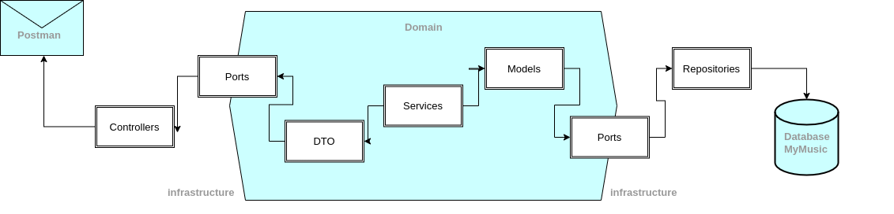
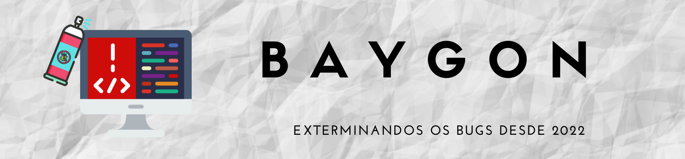

  
  
   

<h1 align="center">
My Music 2022
    
B A Y G O N
</h1>

  <h3>See Our Documentation</h3>
   
<a href="https://baygon-mymusic.herokuapp.com/swagger-ui/index.html">MyMusic</a> & <a href="https://baygon-token-provider.herokuapp.com/swagger-ui/index.html">Token Provider</a>

<h3 align="center"> 

</h3>

 <a href="#-about-the-project">About</a> •
 <a href="#triangular_ruler-architecture">Architecture</a> • 
 <a href="#gear-features">Features</a> • 
 <a href="#hammer_and_wrench-technologies-and-tools">Technologies and tools</a> • 
 <a href="#t-e-a-m-">Team</a> • 
 <a href="#handshake-project-management">Project management</a> •
 <a href="#robot-contributors">Contributors</a>

 

## 💻 About the project
In order to apply all the content studied in CI&T’s Bootcamp, our team had the challenge of developing new services to replace the legacy APIs layer using the existing database. 

## :triangular_ruler: Architecture
To carry out this project we chose the Hexagonal architecture. The reason for this choice is that with hexagonal architecture we have the following benefits:
- Independent External Services Solution, that is, if there is any external auteration, our service will not be impacted;
- Creation and replacement of adapters;
- Easy to test the application;
- Technologies that are easy to exchange;
<h1 align="center">
 
</h1>

## :gear: Features
- [X]  Authentication and authorization (Login/Logout);
- [X]  Allows the user to search for new musics in the database;
- [X]  Allows the user to search his playlist in the database;
- [X]  Allow the user to choose the musics from the search result they want to add to their playlist;
- [X]  Allow the user to remove musics from their playlist;
- [X]  100% covered unit test cases (Jacoco);
- [X]  100% covered mutation test case (PiTest);
- [X]  Cache implementation in search of musics;
- [X]  Pipeline creation with github actions for automated API publishing;

## :hammer_and_wrench: Technologies and tools
- Java 11;
- Spring Boot;
- Maven;
- Spring Boot Actuator;
- JPA / Hibernate;
- SQLite;
- JUnit;
- Mockito;
- JaCoCo (Java Code Coverage Library);
- Pitest (PIT Mutation Testing);
- Swagger;
- Heroku;
- Postman;
- Intellij IDEA;
- Git & GitHub;

----

<h1 align="center">
T E A M
 
</h1>

## :handshake: Project management
##### To manage the project, the following rites were performed:
- Daily;
- Planning;
- Demo e retrospective;
- Checkpoint Técnico semanal;

## :robot: Contributors

